# Evenly

A multi-user expense-splitting web app. Make a group, add the people you share costs with, log
expenses, and the app tracks who owes whom. When it is time to settle up, it works out the
smallest set of payments that clears everyone's debts. You can also photograph a receipt and the
app reads the line items and total for you, or type an expense in plain English, so adding one is
mostly automatic.

Built with Next.js, TypeScript, and Supabase. Runs entirely on free tiers.

**Live app:** https://evenly-evenly1.vercel.app

<p align="center">
  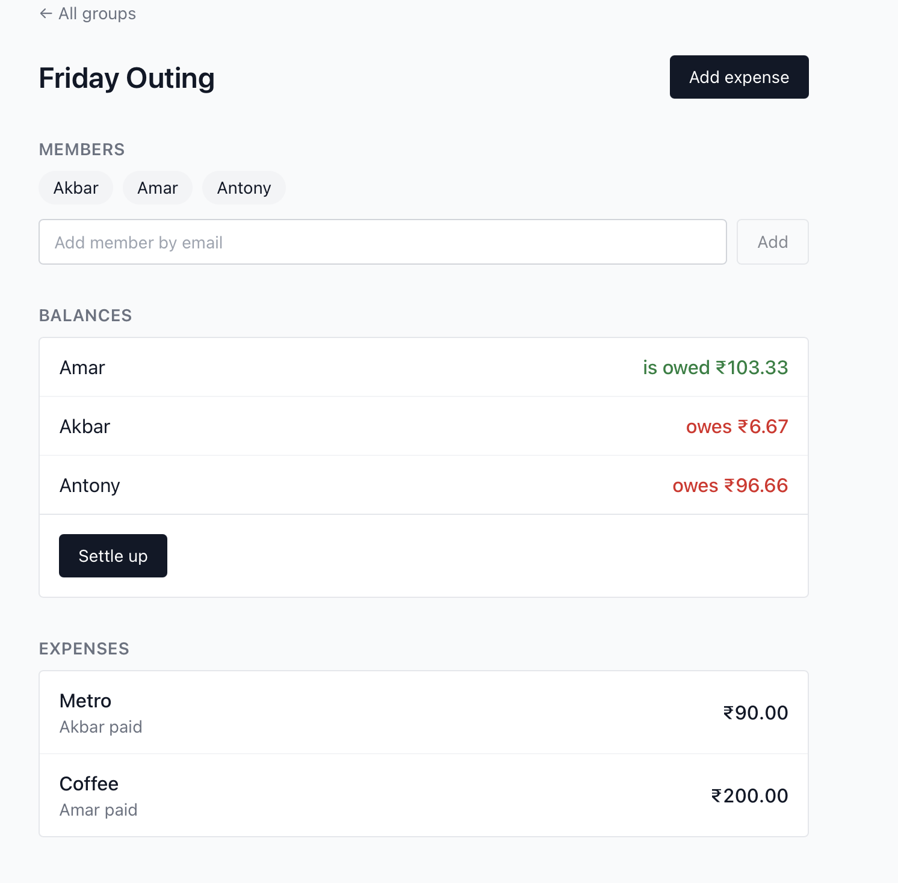
  <br>
  <sub>A group page: members, each person's net balance, and the shared expense list.</sub>
</p>

## The novel angle

Three things make this more than a standard CRUD app:

1. **Receipt OCR with auto-naming.** Upload a receipt photo and Tesseract.js reads it in the
   browser. The app parses item lines and the total, then prefills the expense form (the detected
   total is editable, so you can fix a misread digit) and suggests a name from the merchant at the
   top of the receipt. This adds a computer-vision piece to an otherwise plain database app, and it
   runs client side so the image never leaves the user's device.

2. **Debt simplification.** Splitting costs in a group creates a tangle of small debts. The
   settlement step collapses that into the fewest payments using a greedy algorithm (repeatedly
   pay the biggest debtor's balance toward the biggest creditor). Six scattered IOUs can become
   three clean payments.

3. **AI-assisted entry.** An open-weight model (Llama 3.3, via Groq) turns messy receipt text into
   a cleaner name, a category, and a total, and turns a sentence like "I paid 900 for dinner, split
   among all" into a filled-in expense. It runs behind a server route so the key stays private, and
   it falls back to the plain heuristics when no key is set, so the app still works without it.

<p align="center">
  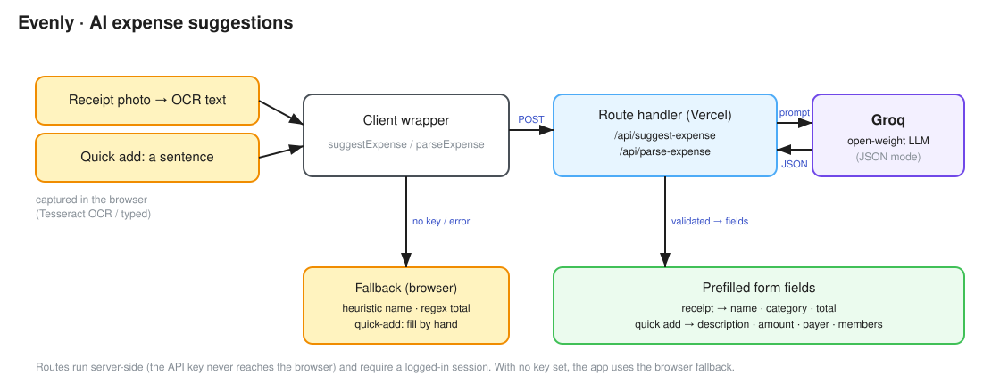
  <br>
  <sub>Receipt scans and one-line "quick add" both go through a server route to an open-weight model, with an on-device fallback.</sub>
</p>

The two AI entry paths in action:

<p align="center">
  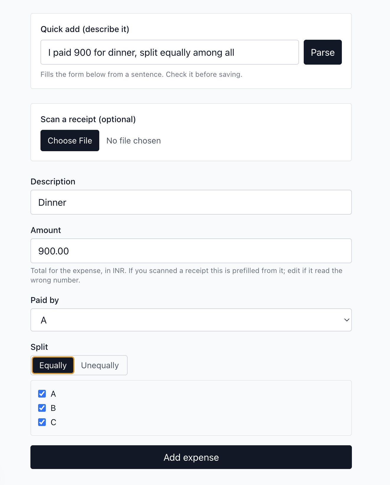
  <br>
  <sub>Quick add: one sentence fills the description, amount, payer, and split (checked for review before saving).</sub>
</p>

<p align="center">
  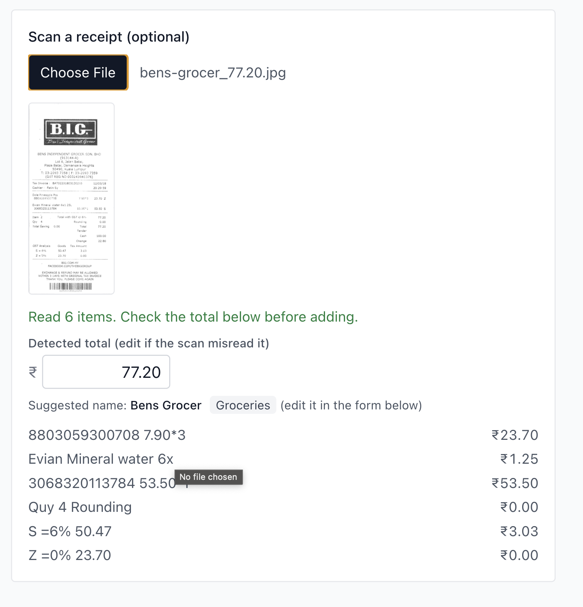
  <br>
  <sub>A receipt scan: the model suggests a name and a category and reads the total (₹77.20), all editable.</sub>
</p>

The OCR and debt features in action:

<p align="center">
  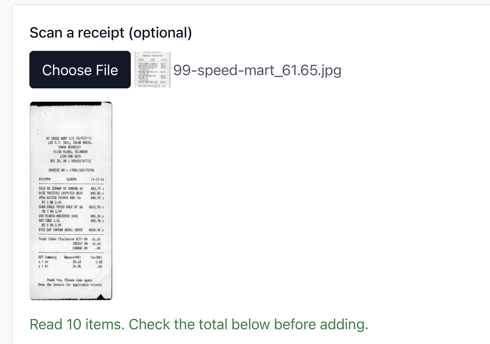
  <br>
  <sub>Upload a receipt photo and Tesseract.js reads it in the browser, no server round trip.</sub>
</p>

<p align="center">
  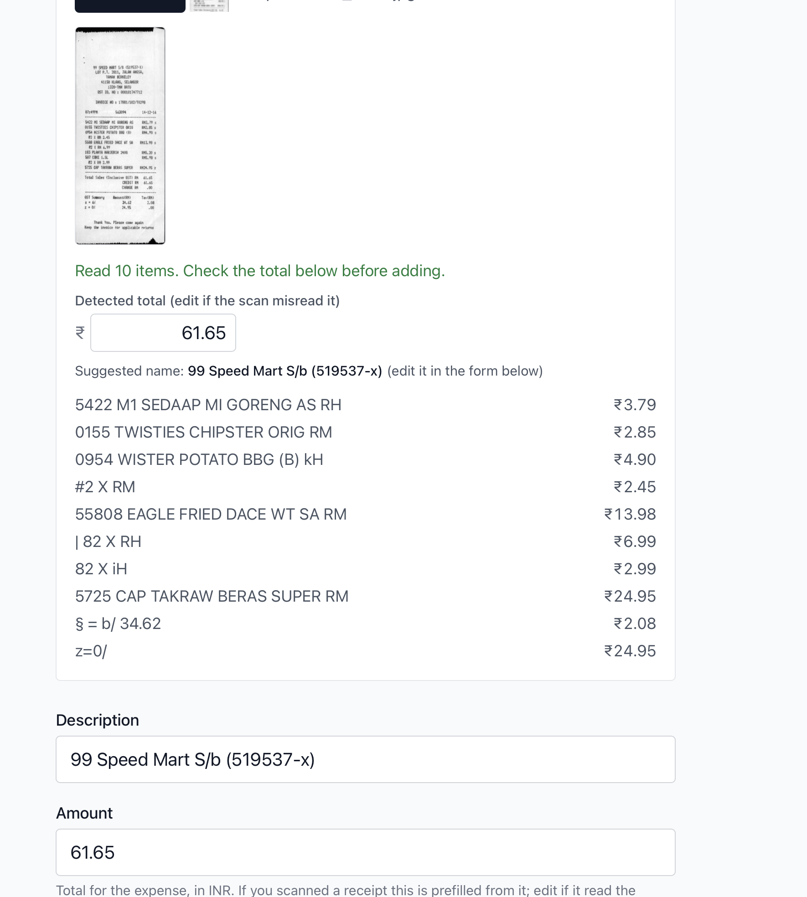
  <br>
  <sub>The detected total (editable, in case a digit is misread) and a merchant name prefill the expense form.</sub>
</p>

<p align="center">
  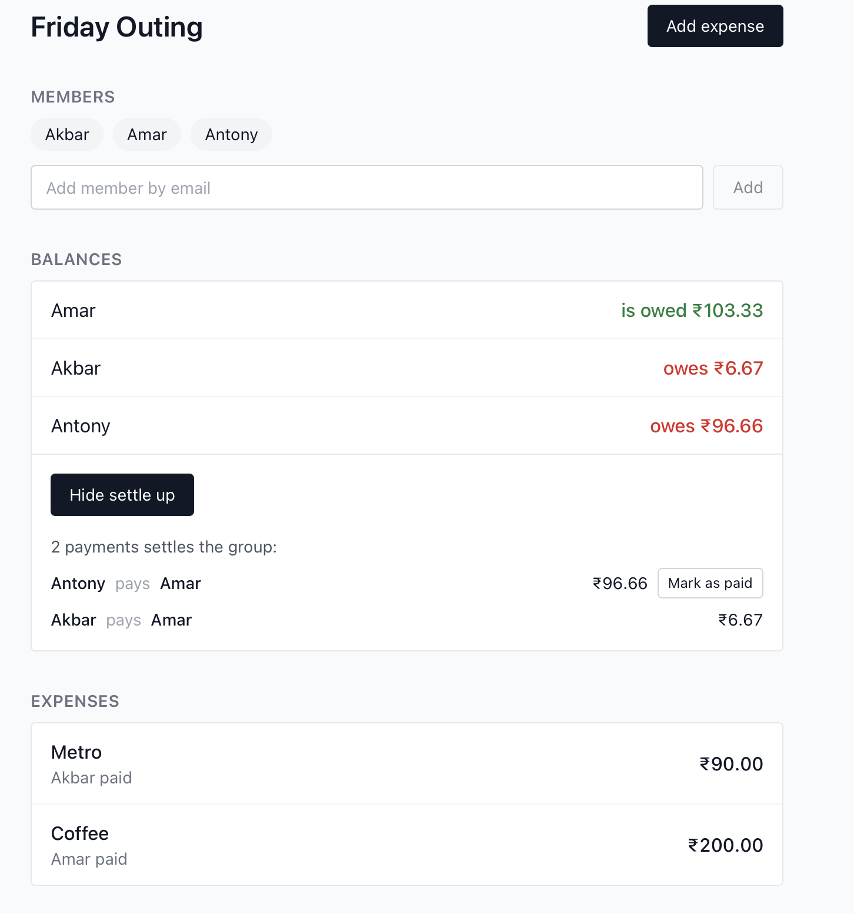
  <br>
  <sub>Settle up: three lopsided balances collapse to two payments, each with a "Mark as paid" button.</sub>
</p>

## Features

- Email/password auth via Supabase Auth.
- Groups with members.
- Add expenses with an even or unequal split (type each person's share) across selected members.
- Per-group balances showing each person's net position.
- Settle-up: simplified payment suggestions, each with a "Mark as paid" button that
  records the payment so the debt clears and balances drop to zero.
- Receipt upload with in-browser OCR that prefills the amount (editable if it misreads) and
  auto-names the expense from the merchant on the receipt.
- Optional AI pass on a scan: a cleaner name, a suggested category, and a total cross-check from an
  open-weight model, with the OCR heuristics as the fallback.
- Natural-language quick add: describe an expense in a sentence and it fills the form (amount, who
  paid, and who shares the cost).
- Amounts in rupees by default (one setting in `lib/currency.ts` to switch currency).
- Row level security so users only ever see groups they belong to.
- Realtime updates so a shared group page refreshes across clients.

## A quick tour

Sign up or sign in with email and password:

<p align="center">
  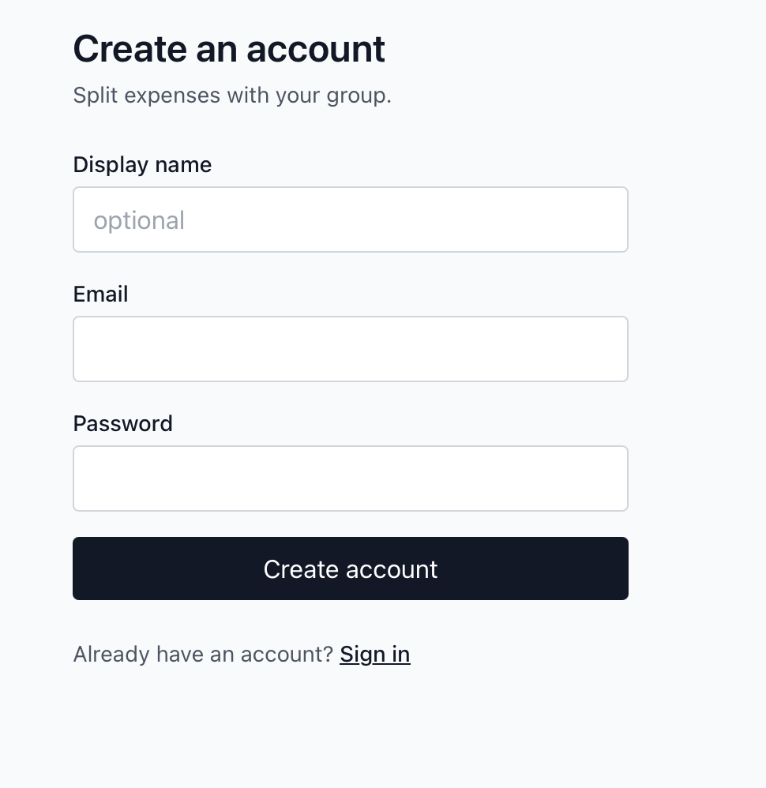
  &nbsp;&nbsp;
  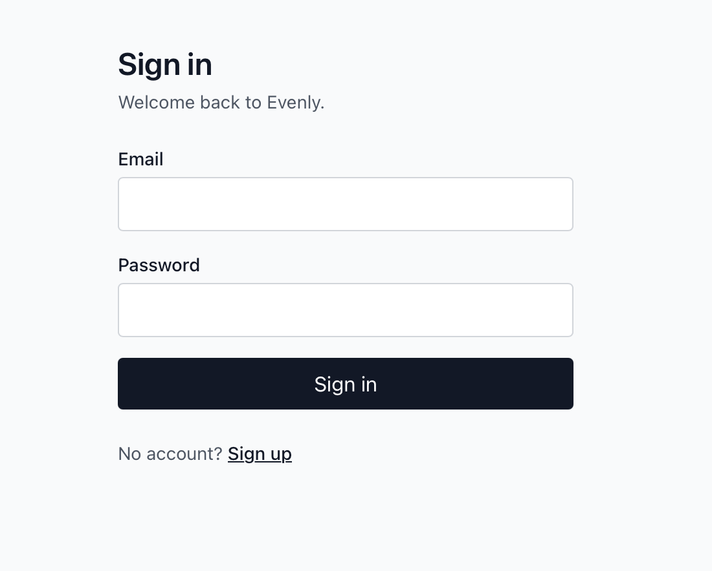
</p>

The dashboard lists your groups and creates new ones:

<p align="center">
  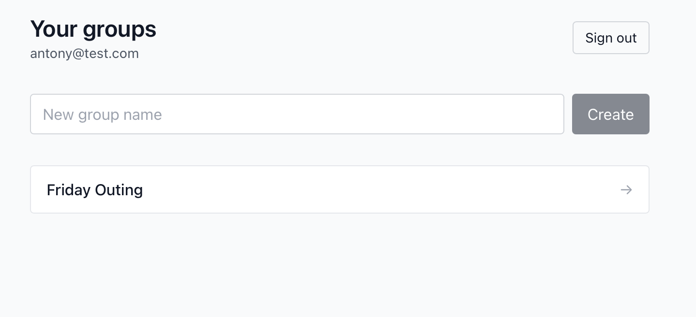
</p>

Adding an expense: pick who paid, the amount, and split it equally or by custom amounts across
the members you select (a receipt scan prefills the amount and name):

<p align="center">
  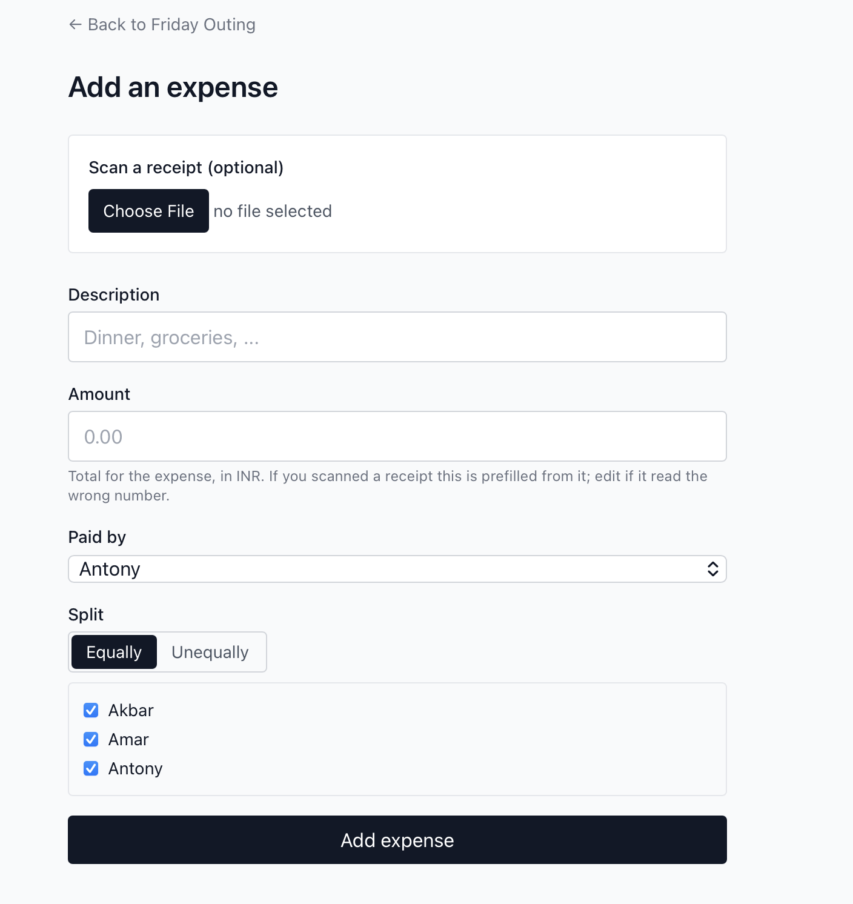
</p>

## Tech stack

- Next.js 15 (App Router) + TypeScript
- Tailwind CSS
- Supabase: Auth, Postgres, Storage, Realtime
- Tesseract.js for OCR
- Groq (hosted open-weight LLM) for expense name, category, total, and natural-language entry
- Vitest for unit tests

## Folder structure

```
app/          Next.js App Router routes (auth, dashboard, group page, add-expense)
              + api/ route handlers (suggest-expense, parse-expense)
components/   GroupList, ExpenseForm, BalanceList, ReceiptUpload
lib/          supabaseClient, settle (debt simplification), ocr, expenseName (heuristic naming),
              suggestExpense + parseExpense (LLM route clients), categories, currency, format, types
supabase/     schema.sql (tables, RLS, storage bucket)
tests/        vitest tests for settlement, OCR parsing, money formatting, naming, categories,
              and the suggestion/parse wrappers
docs/         architecture.md (diagrams), concepts.md, design-decisions.md
```

## Results

- OCR reads the correct grand total on 70% of real receipts and extracts some total on 90%, validated against 113 images from the ICDAR 2019 SROIE dataset.
- Settlement collapses group debts into the minimum number of payments (at most members - 1).
