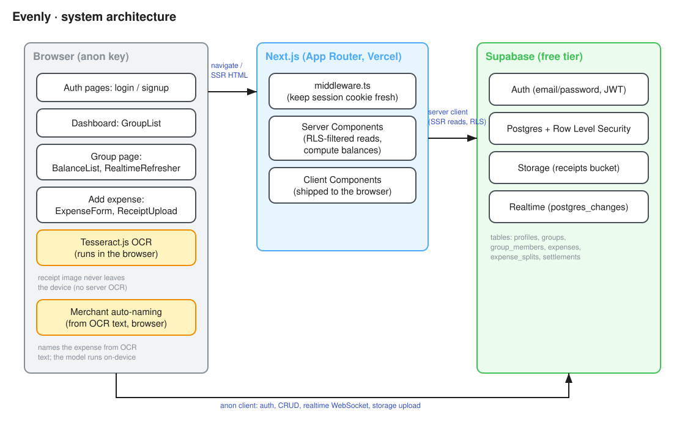
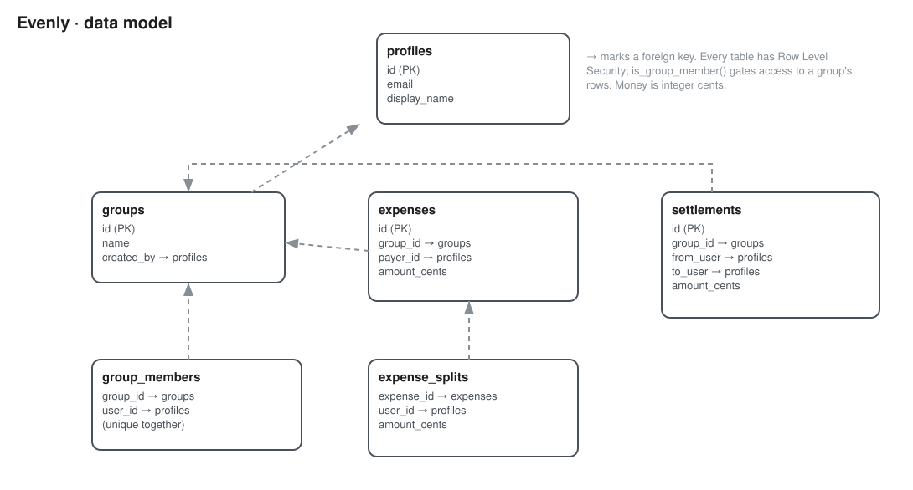
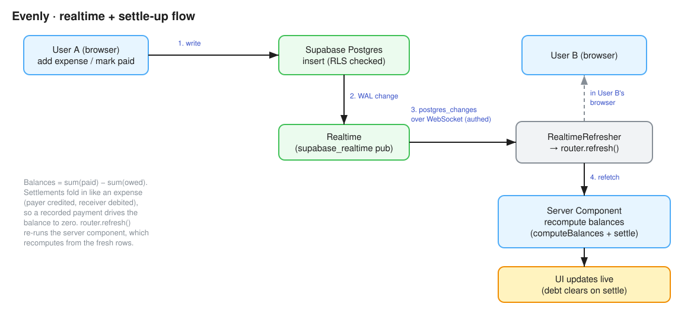

# Architecture

How the pieces fit together, in three diagrams. The `.svg` files render inline
below; the matching `.excalidraw` files in [diagrams/](diagrams/) are the
editable source (see [Editing the diagrams](#editing-the-diagrams)).

## System architecture

Three parts:

- **Browser.** Next.js client components run here with the Supabase anon key.
  They render the auth pages, dashboard, group page, and add-expense form. The
  receipt OCR (Tesseract.js) also runs in the browser, so the image never
  leaves the device and there is no server OCR route. The expense name is taken
  from the merchant at the top of the OCR text, also on-device, with no model.
- **Next.js (App Router, on Vercel).** `middleware.ts` keeps the auth session
  cookie fresh. Server components read data (already filtered by row level
  security) and compute balances before sending HTML. Client components are
  shipped to the browser as part of the bundle.
- **Supabase.** Auth (email/password, issuing a JWT), Postgres with row level
  security, Storage for the receipts bucket, and Realtime.

There are two ways the app talks to Supabase. Server components use a
server-side client during rendering (SSR reads). The browser uses the anon
client directly for auth, CRUD, the realtime WebSocket, and storage uploads.
Both go through the same row level security, so the anon key being public is
fine: the database, not the key, is what controls access.

## Data model

Six tables, all money in integer minor units (paise for the default rupee
currency, cents for USD). `profiles` mirrors `auth.users`. `groups` are owned by
a creator; `group_members` is the join table that decides who can see a group.
`expenses` records who paid and how much; `expense_splits` records each member's
share (the shares sum to the expense amount, whether split evenly or by
per-member amounts). `settlements` records a payment from one member to another.

Every table has row level security. The `is_group_member()` helper (a
`SECURITY DEFINER` function) is the gate: you can read or write a group's rows
only if you belong to it. That helper also avoids the infinite recursion you
would get if the `group_members` policy queried `group_members` directly.

## Realtime and settle-up flow

Balances are never stored. They are computed as `sum(paid) - sum(owed)` per
member, where a settlement folds in like an expense (the payer is credited, the
receiver debited), so recording a payment drives the balance toward zero.

When one client writes (adds an expense, or marks a suggested payment as paid),
Postgres emits a change on the `supabase_realtime` publication. Realtime pushes
it over an authenticated WebSocket to the other client's `RealtimeRefresher`,
which calls `router.refresh()`. That re-runs the server component, which
recomputes balances from the fresh rows, and the UI updates live. Two details
make this work: the tables must be in the publication, and the socket must send
the user's access token or row level security filters every event out.

## Editing the diagrams

The `.excalidraw` files are the source of truth. Open one in the
[Excalidraw VS Code extension](https://marketplace.visualstudio.com/items?itemName=pomdtr.excalidraw-editor)
or import it at [excalidraw.com](https://excalidraw.com). After editing, export
to SVG (same file name) so the inline images above stay in sync.
